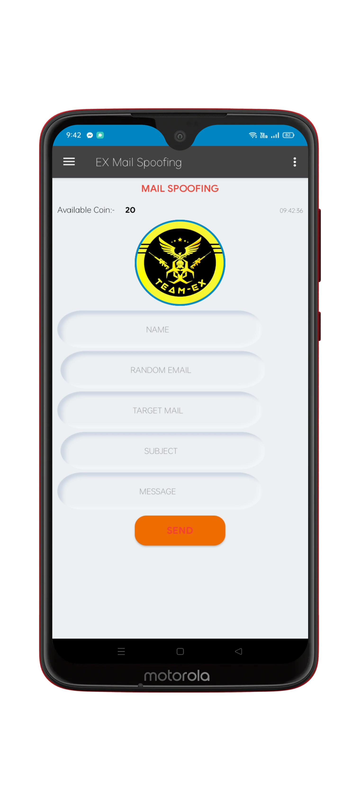

# Ex-Mail-Spoofing-
Ex Email spoofing is the creation of email messages with a forged sender address. The term applies to email purporting to be from an address which is not actually the sender's; mail sent in reply to that address may bounce or be delivered to an unrelated party whose identity has been faked

 


## Demo




## Authors

- [@TEAM EX](https://t.me/Teamex07)


## Developer By


<a href="https://t.me/Teamex07">TEAM EX</a>


## Features


- [01] EMAIL LOG IN TURNED On
- [02] KEY APPROVAL TURNED OFF ✅
- [03]ALL ACTIVITY UNLOCKED ✅
- [04]APP TOTALLY FREE😊
- [05] DAILY LIMIT 25


## Feedback

If you have any feedback, please reach out to us at teamex202207@gmail.com
    


## Terms & Conditions 

```javascript
We have some terms and conditions.
if you Don't follow them,We will be not responsible for your illegal activities.../>
}
```


## Support

For support, Talegram <a href="https://t.me/Teamex07">Talegram</a> join our channel.


## Download 
<a href="https://raw.githubusercontent.com/Teamex07/Ex-Mail-Spoofing-/main/EX%20Mail%20Spoofing.apk">DOWNLOAD NOW</a>
